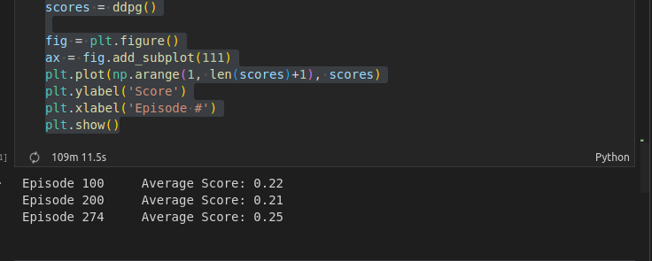
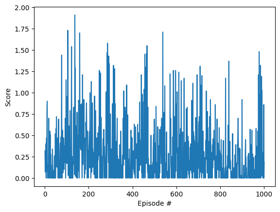
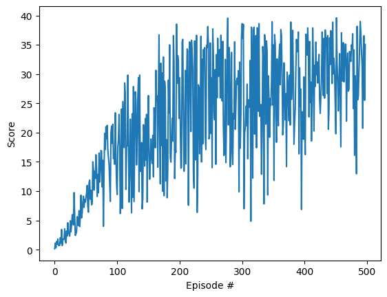

[//]: # (Image References)

[image1]: https://user-images.githubusercontent.com/10624937/43851024-320ba930-9aff-11e8-8493-ee547c6af349.gif "Trained Agent"
[image2]: https://user-images.githubusercontent.com/10624937/43851646-d899bf20-9b00-11e8-858c-29b5c2c94ccc.png "Crawler"

# Project 2: Continuous Control

### Introduction

For this project, you will work with the [Reacher](https://github.com/Unity-Technologies/ml-agents/blob/master/docs/Learning-Environment-Examples.md#reacher) environment.

![Trained Agent][image1]

In this environment, a double-jointed arm can move to target locations. A reward of +0.1 is provided for each step that the agent's hand is in the goal location. Thus, the goal of your agent is to maintain its position at the target location for as many time steps as possible.

The observation space consists of 33 variables corresponding to position, rotation, velocity, and angular velocities of the arm. Each action is a vector with four numbers, corresponding to torque applicable to two joints. Every entry in the action vector should be a number between -1 and 1.

#### Option 1: Solve the First Version

The task is episodic, and in order to solve the environment,  your agent must get an average score of +30 over 100 consecutive episodes.

### Instructions

Follow the instructions in `Continuous_Control.ipynb` to get started with training your own agent!  

### Quickstart

1. The python environment used in this project is similar to ones used in my [Project I](https://github.com/minhnna1112/banana-dqn-brain), with `torch==2.0.0` and `grpcio==1.53.0`
2. There will be 2 options to start this notebook on your local machine.
- Start locally: Run `python3 -m pip install .` in the terminal
- Use with docker: Run `make all RUN=1`
3. Re-run every cells in `Continuous_Control_solution.ipynb`

### Solution!!!
Below is my solution for Option 1 task
#### Baseline
I began with a baseline of the original DDPG used in the `ddpg-pendulum` example, with `state` being a `(33,1)` vector and `action` being a `(4,1)` vector.
   -  However, there was no significant increase in the average score.
   -  The chart below show the average scores after 1000 episodes. .

#### Modified Neural Architecture
I modified the neural architectures of `Actor` and `Critic`, referenced from [Anh-BK](https://github.com/Anh-BK/drl_continuous_control/blob/main/network/network_backbone.py) works [[1]](#1),  so that it would be easier to tune the number of hidden layers:
- After training for only 498 episodes, my agent has achieved an average score of `30.12`
- Here is the plot of the scores achieved after each episode.

- The checkpoint of the actor  is saved in `checkpoint_actor.pth`
- The checkpoint of the critic is saved in `checkpoint_critic.pth`

###  Future plan:
- Integrate [wandb](https://wandb.ai/) into training pipeline to have better visualization with different hyper-parameters (epsion, hidden units in the Q-nets).
- Try experiments with TD3 method [[2]](#2). I have included a placeholder to train a TD3 agent. TD3 is considered to be more effective than DDPG since it does not rely heavily on hyper-parameter tuning. I have adapted a version of the original [TD3](https://github.com/sfujim/TD3/blob/master/TD3.py) in `agent/TD3.py`

### References
[1] [Anh-BK Continuous Control](https://github.com/Anh-BK/drl_continuous_control/)

[2] [Original TD3](https://github.com/sfujim/TD3/)